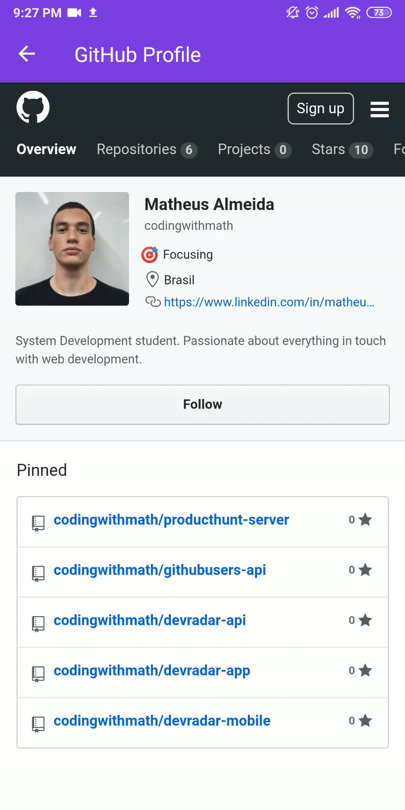

<h1 align="center">
<br>
  
<br>
<br>
DevRadar
</h1>

<p align="center">this project is the result of OmniStack 10.0. OmniStack is a project created and organized by RocketSeat</p>

<p align="center">
  <a href="https://opensource.org/licenses/MIT">
    
  </a>
</p>

<div align="center">
  
  
</div>

<hr />

## About This Project

This project is a mobile app build with React Native + Expo that register users based on their GitHub profile, technologies that they use and their location.

## Features

- ⚛️ **React Native** — A lib that provides a way to create native apps for Android and iOS
- :calling: **Expo** - a framework and a platform for universal React applications 
- :recycle: **Socket IO** - Realtime manager

## Getting started

### Installing

**Cloning the Repository**

```
$ git clone https://github.com/codingwithmath/devradar-mobile

$ cd devradar-mobile
```

**Installing dependencies**

```
$ yarn
```

**Connecting the App with the Server

1 - Follow the instructions on the [DevRadar-api](https://github.com/codingwithmath/devradar-api) to have the server up and running on your machine

2 - Change the baseURL: 'IP_OF_YOUR_MACHINE:3333', in services/api.js to your IP

With all dependencies installed and the environment properly configured, you can now run the application:

```
$ yarn start
```

## License

This project is licensed under the MIT License - see the [LICENSE](https://opensource.org/licenses/MIT) page for details.
